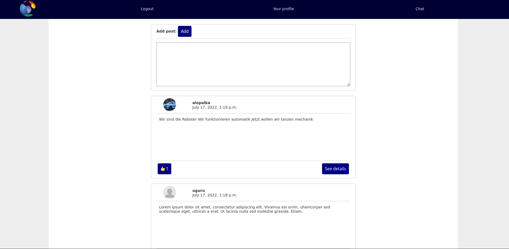
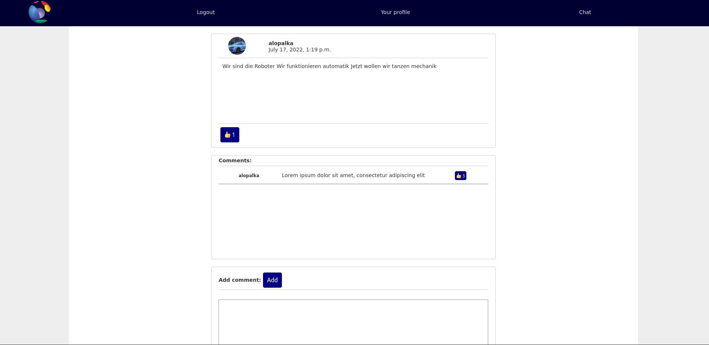
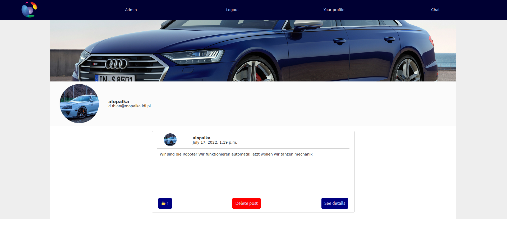
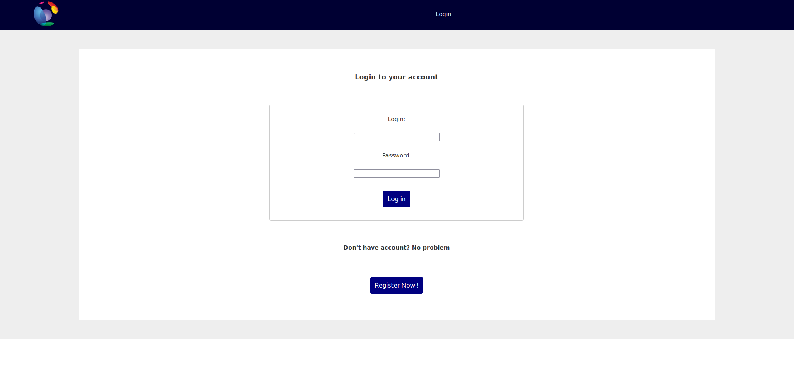
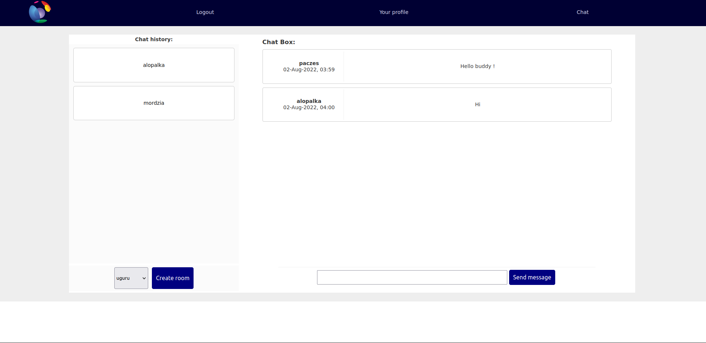

# Django_Social_Media

### What is this project?

Simple clone of Facebook. Created in Python framework called Django.

### What features this projects includes?

- Posts
- Profile details
- User authentication
- Comments 
- Chat logic

### Features

#### Posts & Comments

- Users can make posts that are visible for everyone on their main page.
- You can give like to this post.
- By going to details you can read comments and add yours if you will
- Also you can give reactions to comments

#### Profile details 

- When you click user profile picture in main page or in post details. You will be redirected to user's profile page
- On that page you can see posts created by this user and user email

#### User authentication

- You can't enter the page without being a user
- Page will force you to login
- If you don't have an account you can register by clicking in "Register now!"

#### Chat logic

- You chat with users you have to create chat room
- When chat room is created you can send message to user and it will only be visible for them.
- Chat uses Django Rest Framework. To enable more dynamic interactions.
- It is not realtime chating.

## Instalation

In order to install project 

``` pip install -r requirements.txt```

And you should be ready to go

## Screenshots






